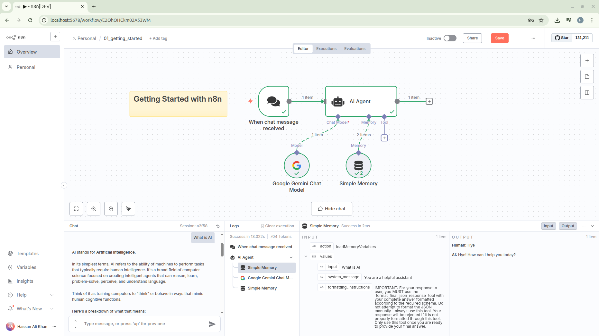

## 01 – Getting Started (AI Chat Workflow)

This example shows a minimal n8n AI chat workflow that wires a chat trigger to an AI Agent powered by Google Gemini (PaLM) with a simple conversational memory.

### Purpose

Demonstrate how to:

1. Receive chat messages in n8n (Chat Trigger node).
2. Use an AI Agent that can call a Large Language Model.
3. Provide a Google Gemini Chat Model as the language backend.
4. Preserve short-term context with a Buffer Window Memory.

### Nodes Breakdown

| Node Name                  | Type                                          | Role                                                                            |
| -------------------------- | --------------------------------------------- | ------------------------------------------------------------------------------- |
| When chat message received | `@n8n/n8n-nodes-langchain.chatTrigger`        | Entry point whenever a user sends a chat message via the n8n AI Chat interface. |
| AI Agent                   | `@n8n/n8n-nodes-langchain.agent`              | Orchestrates calls to the LLM and integrates memory.                            |
| Google Gemini Chat Model   | `@n8n/n8n-nodes-langchain.lmChatGoogleGemini` | The underlying Large Language Model (Gemini / PaLM).                            |
| Simple Memory              | `@n8n/n8n-nodes-langchain.memoryBufferWindow` | Maintains a recent message window for conversational continuity.                |

### Data Flow

1. User sends a chat message → Chat Trigger fires.
2. Trigger output routes directly to the AI Agent.
3. The AI Agent references:
   - The Google Gemini Chat Model (for responses)
   - The Simple Memory (for context window)
4. The Agent returns a response that the chat interface displays.

### Credentials & Configuration

You must configure a Google Gemini (PaLM) API credential in n8n:

1. In n8n UI go to: Credentials → New → Search for Google PaLM / Gemini.
2. Provide your API Key (keep it secret; do not commit it).
3. Assign the credential (named in the workflow as: `Google Gemini(PaLM) Api account`).

No hard‑coded secrets exist in the JSON; ensure credentials are set before activation.

### Importing the Workflow

1. Open n8n → Workflows → Import from File.
2. Select `01_getting_started.json`.
3. Save.

### Running / Testing

1. After import, open the workflow.
2. Ensure the credential is connected (no red warning on the Gemini node).
3. (Optional) Adjust memory window size in the Memory node if needed.
4. Activate the workflow OR use the Chat view (top-right) to send a test message while in the editor.
5. Observe responses; memory will maintain a rolling window so follow-up questions can reference prior answers.

### Customization Ideas

- Swap the Gemini node for OpenAI / other supported LLM models.
- Add a Tools node (e.g., HTTP requests, vector store) and wire it into the Agent for augmented capabilities.
- Persist full conversation history to a database node for analytics.

### Troubleshooting

| Issue                       | Cause                      | Fix                                            |
| --------------------------- | -------------------------- | ---------------------------------------------- |
| Empty / error response      | Missing or invalid API key | Re-check credential validity.                  |
| Memory not affecting output | Window too small           | Increase buffer window in memory node options. |
| Trigger not firing          | Workflow inactive          | Activate workflow or use manual chat testing.  |

### File Reference

`01_getting_started.json` – The workflow export you can import directly into n8n.

### License

See root `LICENSE` file of this repository.

---

Feel free to extend this starter to explore tools, RAG, and more advanced agent behaviors.
