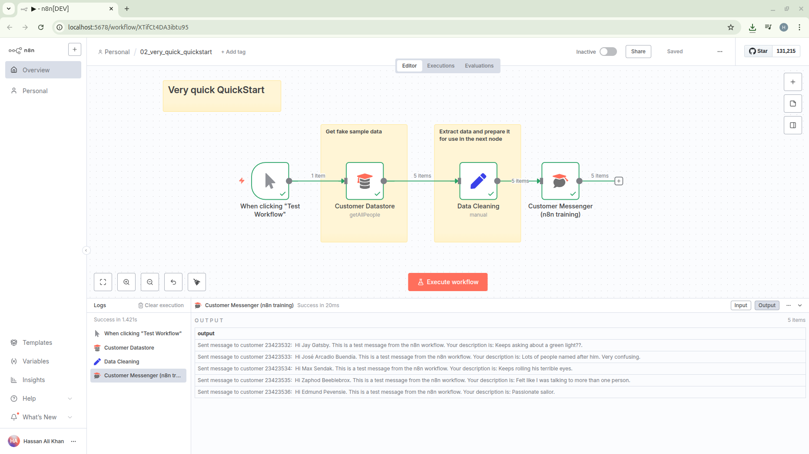

## 02 – Very Quick QuickStart

This workflow demonstrates a minimal end‑to‑end pattern in n8n: trigger → fetch sample customer records → clean/shape fields → send a templated message.



### Goal
Show how to pull structured data, map it into a cleaner schema, and act on each item (send a message) with almost no extra configuration.

### Nodes
| Node | Type | Purpose |
|------|------|---------|
| When clicking "Test Workflow" | `n8n-nodes-base.manualTrigger` | Manual entry point used while designing/testing. |
| Customer Datastore | `n8n-nodes-base.n8nTrainingCustomerDatastore` | Returns a list of sample (fake) customers. `returnAll: true` fetches all people. |
| Data Cleaning | `n8n-nodes-base.set` | Renames / maps raw fields (`id`, `name`, `notes`) to `customer_id`, `customer_name`, `customer_description`. |
| Customer Messenger (n8n training) | `n8n-nodes-base.n8nTrainingCustomerMessenger` | Sends a templated message to each customer using the cleaned fields. |

### Data Flow
1. Manual trigger fires the workflow in the editor.
2. Customer Datastore outputs an array of customer objects (id, name, notes, etc.).
3. Data Cleaning node maps each object to a trimmed structure expected downstream.
4. Customer Messenger node sends a custom message per customer using expression interpolation.

### Field Mapping Details (Data Cleaning)
| Output Field | Expression | Source |
|--------------|------------|--------|
| `customer_id` | `={{ $json.id }}` | Original customer id |
| `customer_name` | `={{ $json.name }}` | Original customer name |
| `customer_description` | `={{ $json.notes }}` | Original notes / description |

### Message Template
```
Hi {{ $json.customer_name }}. This is a test message from the n8n workflow. Your description is: {{ $json.customer_description }}.
```

### How To Run
1. Import `02_very_quick_quickstart.json` into n8n (Workflows → Import from File).
2. Open the workflow.
3. Click "Execute Workflow" (or "Test Workflow") to run manually.
4. Inspect each node's output pane to see the transformation at every step.

### Customization Ideas
- Filter specific customers before messaging (add an IF node after Data Cleaning).
- Add rate limiting or batching if many customers are returned.
- Persist transformed customers to a database (e.g., Postgres) before sending messages.
- Localize the message template based on a customer locale field.

### Troubleshooting
| Symptom | Possible Cause | Resolution |
|---------|----------------|------------|
| No items reach messenger | Datastore returned empty array | Confirm training dataset is enabled; remove filters. |
| Empty message fields | Expressions mismatched | Verify the Set node field names match those used in the messenger expression. |
| Too many messages | `returnAll` returns all customers | Limit results (toggle off `returnAll` or add a Slice / IF). |

### File Reference
`02_very_quick_quickstart.json` – The workflow export.

### License
See the root `LICENSE` for terms.

---
Extend this quickstart by inserting validation, conditional routing, and external integrations.
