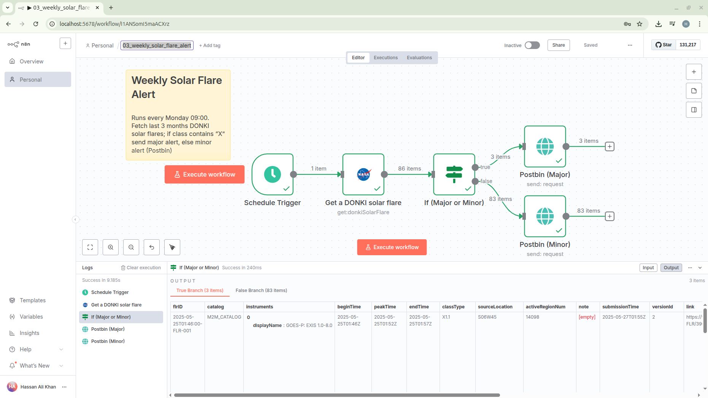

## 03 – Weekly Solar Flare Alert

Automated weekly check (every Monday at 09:00) of NASA DONKI solar flare data over the past 3 months. Sends a different notification depending on whether any returned flare has an X-class designation.

### Goal

Provide a scheduled space weather monitor that distinguishes between major (X-class) and other flare classes and posts a concise alert message.

### Schedule

Runs: Weekly (interval of 1 week) on Monday at 09:00 (server time set in n8n). Adjust timing inside the `Schedule Trigger` node if needed.

### Nodes

| Node                    | Type                             | Purpose                                                                                                         |
| ----------------------- | -------------------------------- | --------------------------------------------------------------------------------------------------------------- |
| Schedule Trigger        | `n8n-nodes-base.scheduleTrigger` | Fires the workflow weekly on the configured day/time.                                                           |
| Get a DONKI solar flare | `n8n-nodes-base.nasa`            | Queries NASA DONKI Solar Flare endpoint. Uses `startDate = {{$today.minus(3, "month")}}` to look back 3 months. |
| If (Major or Minor)     | `n8n-nodes-base.if`              | Checks if `classType` contains the letter `X` (case-sensitive) to classify severity.                            |
| Postbin (Major)         | `n8n-nodes-base.postBin`         | Sends a “major solar flare” message including the flare class. Executes when condition is true.                 |
| Postbin (Minor)         | `n8n-nodes-base.postBin`         | Sends a “minor solar flare” message when condition is false (no X-class).                                       |

### Data Flow

1. Schedule Trigger launches at the configured weekly interval.
2. NASA node fetches solar flare data (DONKI) since a dynamic start date (3 months prior to now).
3. Each returned flare record flows into the IF node.
4. IF inspects `classType` for the presence of the character `X`.
5. Matching (major) items route to the Postbin (Major) node; others route to Postbin (Minor).
6. A message is posted containing the flare’s `classType` value.

### Expressions & Logic

Start date expression: `{{$today.minus(3, "month")}}` ensures rolling window without manual updates.
IF condition: `{{$json.classType}}` contains `X` (string contains operator). Strict / case-sensitive.

### Credentials

NASA Node requires a NASA API key credential (named here `NASA account`). Configure inside n8n Credentials before activating the workflow. Keep API keys out of version control.

### Setup / Import

1. In n8n, choose Workflows → Import → Select `03_weekly_solar_flare_alert.json`.
2. Open the workflow and set (or relink) the NASA credential.
3. (Optional) Change the schedule (e.g., different hour/day) in `Schedule Trigger`.
4. Run once manually to verify output (Execute Workflow) before activating.
5. Activate the workflow to let it run on schedule.

### Customization Ideas

- Add a notification channel (email, Slack, Discord) instead of / alongside Postbin.
- Aggregate flares and send a single summary rather than per-item messages (use an Item Lists or Code node).
- Filter by region or class threshold (e.g., only M or X) before branching.
- Log results to a database or Google Sheet for historical tracking.
- Add retry / error handling via an Error Trigger workflow.

### Troubleshooting

| Symptom                       | Possible Cause                              | Suggested Fix                                                                            |
| ----------------------------- | ------------------------------------------- | ---------------------------------------------------------------------------------------- |
| No flares returned            | Quiet solar period or incorrect date window | Temporarily widen lookback (e.g., 6 months) to confirm connectivity.                     |
| Credential error              | Missing / invalid NASA API key              | Recreate NASA credential; verify key works via curl.                                     |
| All messages classed as minor | Case sensitivity or no X-class events       | Confirm `classType` values in execution data; adjust condition if you also want M-class. |
| Workflow not running          | Not activated or timezone mismatch          | Activate workflow; verify server timezone vs. desired schedule.                          |

### File Reference

`03_weekly_solar_flare_alert.json` – Importable workflow definition.

### License

Refer to repository root `LICENSE`.

---

Enhance this monitor by adding summaries, dashboards, or multi-channel alert fan-out.
