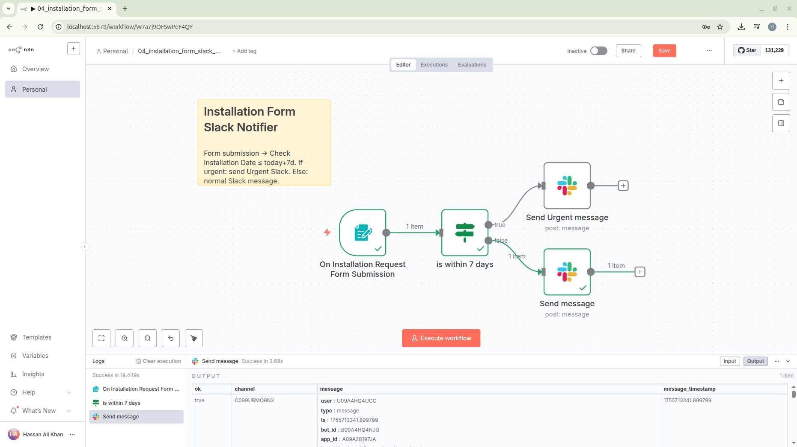

## 04 – Installation Form Slack Notifier

Collect installation requests via a hosted form and send a Slack notification. Requests whose Installation Date is within the next 7 days are marked as urgent.



### Goal

Automate intake and triage of installation requests, highlighting near-term (≤ 7 days) dates to accelerate scheduling.

### Nodes

| Node                                    | Type                         | Purpose                                                                      |
| --------------------------------------- | ---------------------------- | ---------------------------------------------------------------------------- |
| On Installation Request Form Submission | `n8n-nodes-base.formTrigger` | Presents a form (Name, Email, Installation Date) and triggers on submit.     |
| is within 7 days                        | `n8n-nodes-base.if`          | Compares submitted Installation Date to `today + 7 days` (before or equals). |
| Send Urgent message                     | `n8n-nodes-base.slack`       | Sends formatted Slack message flagged as _Urgent_ for near-term installs.    |
| Send message                            | `n8n-nodes-base.slack`       | Sends standard Slack message for non-urgent installs.                        |

### Data Flow

1. User submits the form (fields: Name, Email, Installation Date).
2. IF node evaluates: Installation Date ≤ (current date + 7 days)?
3. True branch → urgent Slack message.
4. False branch → normal Slack message.

### Form Fields

| Label             | Type  | Required |
| ----------------- | ----- | -------- |
| Name              | Text  | Yes      |
| Email             | Email | Yes      |
| Installation Date | Date  | Yes      |

### Urgency Logic

Expression in IF (left side): `{{$json['Installation Date']}}`
Right side dynamic date: `{{$today.plus(7,'days')}}`
Operator: Date/Time → beforeOrEquals
Meaning: Mark as urgent if the installation date is today or occurs within the next 7 days.

### Slack Message Templates

Urgent:

```
*Urgent*

New Install Request (with in 7 days)
*Name:* {{ $json.Name }}
*Email:* {{ $json.Email }}
*Installation Date:* {{ $json['Installation Date'] }}
```

Normal:

```
New Install Request
*Name:* {{ $json.Name }}
*Email:* {{ $json.Email }}
*Installation Date:* {{ $json['Installation Date'] }}
```

### Setup / Run

1. Import `04_installation_form_slack_notifier.json` into n8n.
2. Open the workflow and configure the Slack credential (`Slack account`).
3. (Optional) Adjust the channel in each Slack node.
4. Execute once manually to obtain the public form URL (shown in the Form Trigger node panel) and test a submission.
5. Activate the workflow to start receiving real submissions.

### Customization Ideas

- Add email confirmation (e.g., via SMTP node) after Slack notification.
- Persist submissions to a database or Google Sheet.
- Extend urgency window (change `plus(7,'days')` to a different interval) or add additional tiers (e.g., second IF for 48-hour critical window).
- Validate email format more strictly or add reCAPTCHA via an HTTP node pre-check.

### Troubleshooting

| Symptom                    | Possible Cause                           | Resolution                                                                                                                        |
| -------------------------- | ---------------------------------------- | --------------------------------------------------------------------------------------------------------------------------------- |
| Slack message not sent     | Credential missing or insufficient scope | Re-link Slack credential; ensure chat:write scope.                                                                                |
| All requests marked urgent | Date parsing mismatch or timezone issues | Inspect execution data; ensure form date format aligns with IF evaluation; consider normalizing timezone with a Date & Time node. |
| No form submissions        | Using inactive form or wrong URL         | Retrieve latest form URL from the Form Trigger node after activation.                                                             |
| Email field blank in Slack | User skipped field (should be required)  | Confirm required flag still set; reimport or edit form fields.                                                                    |

### File Reference

`04_installation_form_slack_notifier.json` – Importable workflow definition.

### License

See repository root `LICENSE`.

---

Enhance prioritization by logging response times or auto-creating tickets in your helpdesk system.
