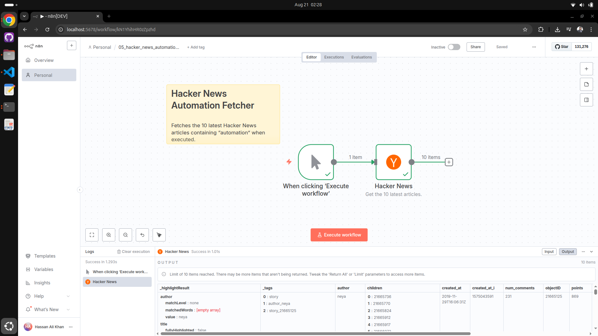

## 05 – Hacker News Automation Fetcher

Fetches the latest Hacker News articles that match the keyword `automation` and returns up to 10 items when executed manually.

### Purpose
Quickly retrieve recent Hacker News posts related to automation for review, processing, or downstream routing.

### Nodes
| Node | Type | Purpose |
|------|------|---------|
| When clicking ‘Execute workflow’ | `n8n-nodes-base.manualTrigger` | Manual entry used during development or ad‑hoc runs. |
| Hacker News | `n8n-nodes-base.hackerNews` | Fetches up to 10 articles matching the `automation` keyword. |

### Configuration
- Resource: `all`
- Limit: `10`
- Keyword: `automation`

These values are set in the `Hacker News` node and can be changed to broaden or narrow results.

### Data Flow
1. Execute the workflow manually.
2. The Hacker News node queries the HN API for items matching `automation`.
3. The node outputs up to 10 result items containing metadata such as title, url, score, and time.

### How to Run
1. Import `05_hacker_news_automation_fetcher.json` into n8n (Workflows → Import).
2. Open the workflow and click "Execute Workflow".
3. Inspect the Hacker News node output to view the fetched articles.

### Customization Ideas
- Increase `limit` to fetch more items or change `keyword` to different topics.
- Add filtering (e.g., min score) using a `Filter` or `IF` node.
- Route items to Slack, email, or a database for sharing or persistence.
- Schedule the workflow with a `Schedule Trigger` node for periodic fetches.

### Troubleshooting
| Symptom | Cause | Fix |
|--------|-------|-----|
| No items returned | No recent posts for keyword | Try a broader keyword or increase lookback. |
| API errors | Network or HN API changes | Verify network access; check HN API status. |

### File Reference
`05_hacker_news_automation_fetcher.json` – Importable workflow.

### License
See repository root `LICENSE`.

---
Feel free to wire this into notifications or a daily digest pipeline.
