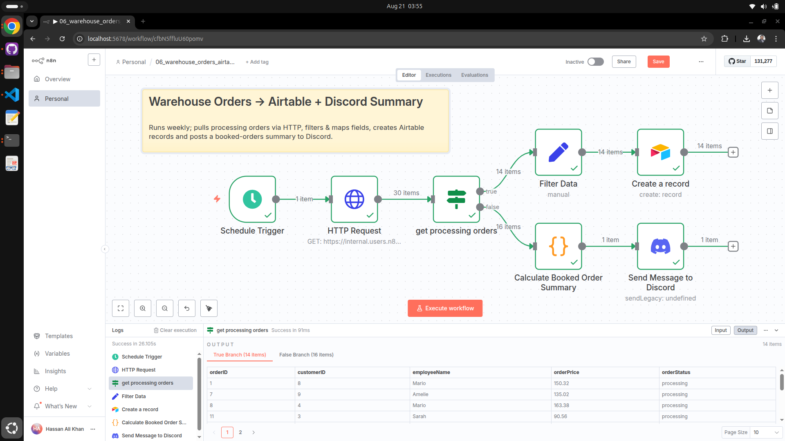

## 06 – Warehouse Orders → Airtable + Discord Summary

Weekly pipeline that pulls orders from an internal ERP webhook, filters for "processing" orders, maps fields for Airtable ingestion, and posts a weekly booked-orders summary to Discord.

### Goal
Automate synchronization of processing orders into Airtable and publish a concise weekly summary of booked orders to a Discord channel.

### Schedule
Runs weekly on Monday at 09:00 (configured in the `Schedule Trigger`). Adjust the trigger if you need a different cadence.

### Nodes & Purpose
- `Schedule Trigger` (`n8n-nodes-base.scheduleTrigger`) — initiates the workflow on the configured weekly schedule.
- `HTTP Request` (`n8n-nodes-base.httpRequest`) — calls an internal ERP webhook using header authentication; includes a `unique_id` header parameter. The node expects an array of order objects.
- `get processing orders` (`n8n-nodes-base.if`) — filters items where `orderStatus` equals `processing`.
- `Filter Data` (`n8n-nodes-base.set`) — maps and types fields (`orderID`, `employeeName`) for downstream insertion.
- `Create a record` (`n8n-nodes-base.airtable`) — inserts mapped records into the specified Airtable base/table.
- `Calculate Booked Order Summary` (`n8n-nodes-base.code`) — aggregates the number of booked orders and the total booked value.
- `Send Message to Discord` (`n8n-nodes-base.discord`) — posts a summary message containing total booked orders and total value; the message pulls the `unique_id` header value from the `HTTP Request` node for traceability.

### Important Expressions
- Header unique id (example): `headerParameters.parameters[0].value` inside `HTTP Request`.
- Summary content uses expressions like `{{$json["totalBooked"]}}` and `{{$json["bookedSum"]}}` produced by the code node.

### Credentials
- `HTTP Request` uses an HTTP header credential (named here `Nathan WareHouse api Key`).
- `Airtable` requires an API token (named here `Airtable Token (Nathon)`).
- `Discord` requires a webhook credential.

Ensure credentials are configured in n8n before activating the workflow. Do NOT commit secrets to source control.

### How to Import & Test
1. Import `06_warehouse_orders_airtable_discord.json` into n8n (Workflows → Import).
2. Link or create credentials for HTTP header auth, Airtable, and Discord.
3. Execute the workflow manually to validate the HTTP response shape and mapping.
4. Inspect the `get processing orders` node to confirm items are flowing correctly.
5. Activate the workflow for weekly runs.

### Customization Ideas
- Add error handling: capture failed HTTP calls or Airtable inserts and forward them to an error queue or channel.
- Debounce or rate-limit Airtable inserts for large batches (use chunking or Wait nodes).
- Add a Slack or email notifier as an alternate channel for the weekly summary.
- Store historical summaries in a database for reporting.

### Troubleshooting
| Symptom | Possible Cause | Fix |
|--------|---------------|-----|
| No items in `get processing orders` | API returned different field names or empty list | Inspect raw HTTP output; adapt the IF condition or parsing. |
| Airtable insert fails | Schema mismatch or missing permissions | Verify column names/types and Airtable token permissions. |
| Discord message missing unique ID | Header path expression incorrect | Confirm the header exists in `HTTP Request` params and adjust expression indexing. |

### File Reference
`06_warehouse_orders_airtable_discord.json` – Importable workflow file.

### License
See repository root `LICENSE`.

---

If you want, I can add a short title and the sticky note text into the workflow JSON for you — tell me which title you prefer from the earlier suggestions.
